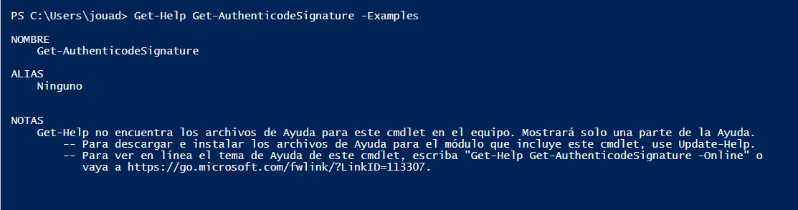

# Primitive-Datatype-tasks

**This activity serves as a small guide to familiarize ourselves with Windows Powershell ISE**

We start by opening Windows Powershell ISE.


## Task 1

Use “Get-Help” to find out more information about 5
cmdlets.

The following commands are executed in this part.

````Get-Help Get-Help
Get-Help New-Item
Get-Help Get-Alias
Get-Help Get-AuthenticodeSignature
Get-Help Get-ControlPanelItem
````

The execution of the different commands of the task:


## Task 2

Use “Get-Help” with the “–Example” parameter for the
5 cmdlets you discovered more about in task 1.

```Get-Help Get-Help -Examples
Get-Help New-Item -Examples
Get-Help Get-Alias -Examples
Get-Help Get-AuthenticodeSignature -Examples
Get-Help Get-ControlPanelItem -Examples
```

The same mechanics as in the previous task but with an example





## Task 3

Create a new text file called "TestFile.txt" in C:\
Jouad\PowerShell\Workshop1\%USERNAME%
The cmdlet to create a new file and directory starts with "New" Notes:
Path names may not match.

Create Directory:


Create file:


## Task 4

Populate the text file you created in task 3 with all three
datatypes we’ve covered: “Boolean”, “String” and “Int”
The cmdlet you need starts with “Add”


## Task 5

Read from the text file and use “Get-Member” to find the
datatype returned
The cmdlet you need to read data from the text file begins to “Get” 


## Task 6

Overwrite all data within the text file that you created in task
3.
The cmdlet you need starts with “Set”


## Task 7

Format the data returned by a cmdlet into a list
You will need to pipe the original cmdlet then use the “Format-List” cmdlet


## Task 8

Pipe “Get-Command” into “Out-GridView”


## Task 9

Pipe the 5 cmdlets you discovered in task 1 into “Out
GridView”

````
Get-Help | Out-GridView
New-Item | Out-GridView
Get-Alias | Out-GridView
Get-AuthenticodeSignature | Out-GridView
Get-ControlPanelItem | Out-GridView
````


## Task 10

Find the official PowerShell documentation library from
Microsoft


